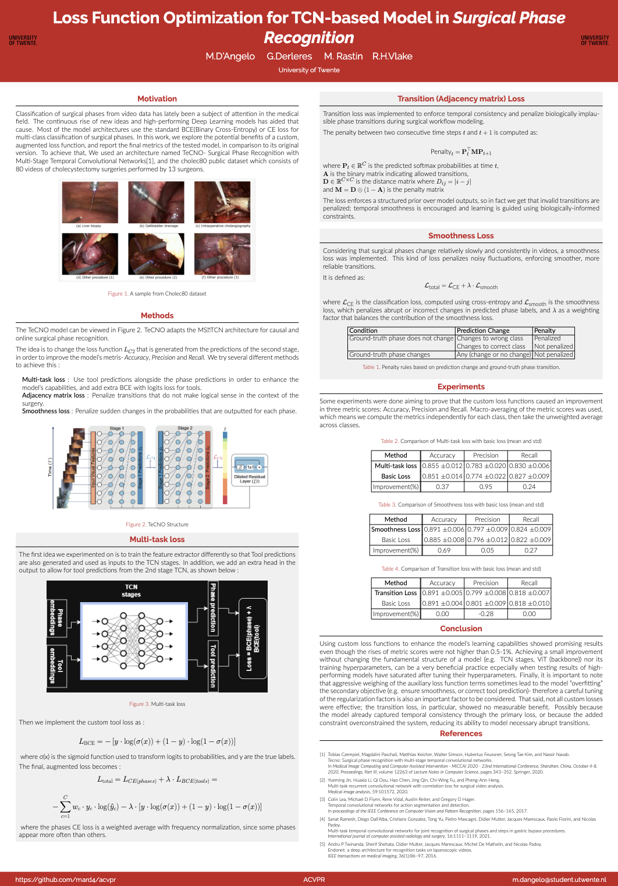
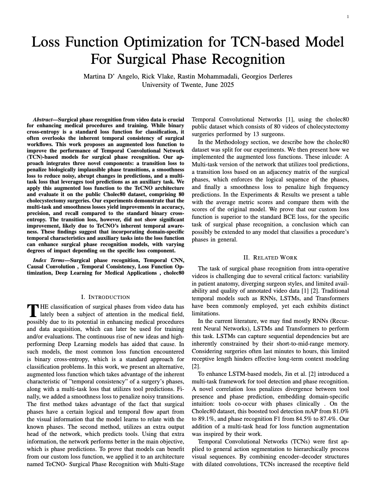
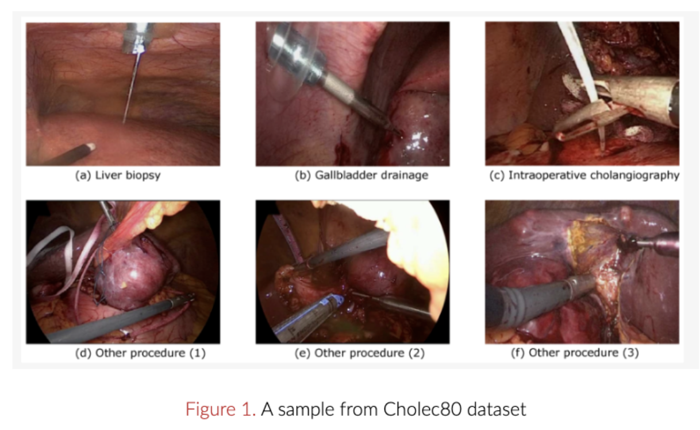
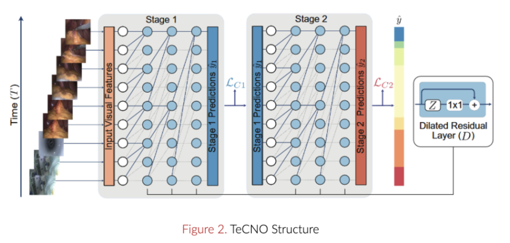
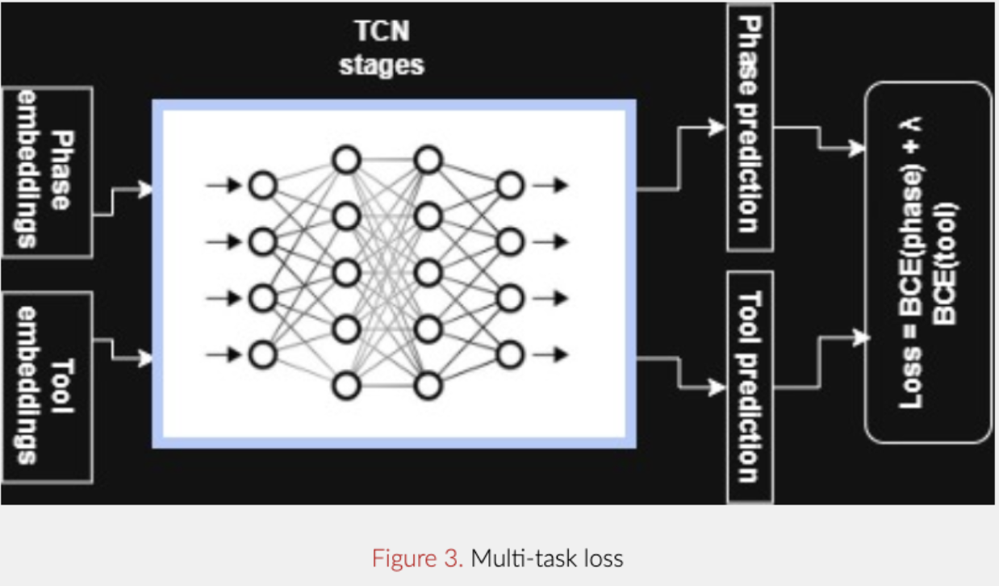
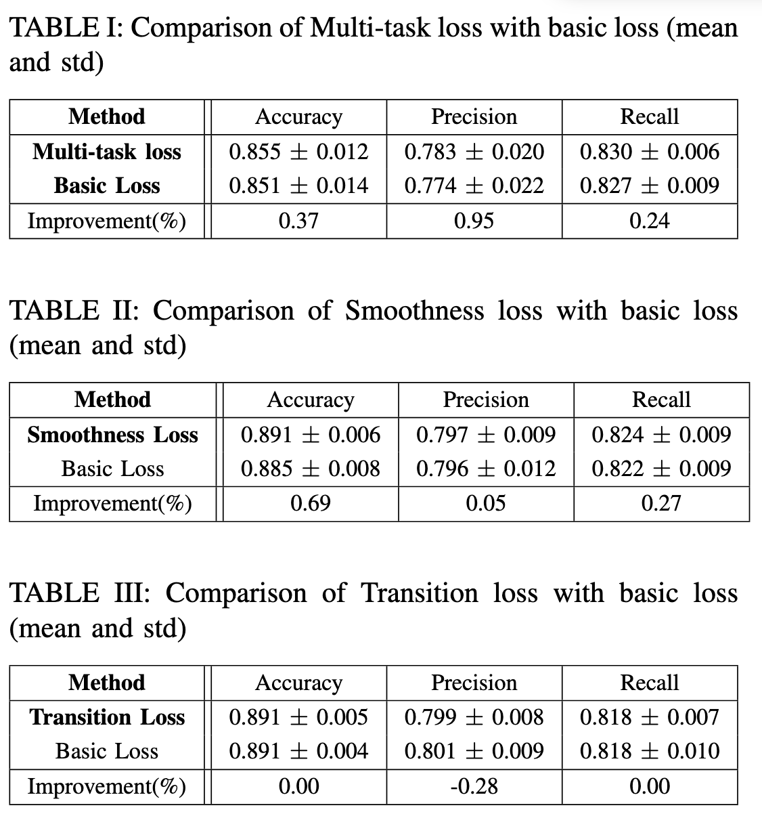

# Surgical Phase Recognition (Advanced Computer Vision & Pattern Recognition)

**Surgical phase recognition** uses AI to analyze live operating room video and identify exactly which step of an operation is currently happening (e.g., cutting, suturing). Two main areas:

* **Medical Procedures:** It can automatically display step-specific patient data on monitors during surgery, or alert hospital staff to prep the recovery room when the AI detects the final phase.
* **Medical Training:** It automatically chapters hours of surgical video into searchable segments, letting students instantly find specific techniques to study and allowing evaluators to compare a trainee's speed on a specific step against expert benchmarks.

 

| <a href="src/PosterACVPR.pdf" target="_blank"><b>Poster</b></a> | <a href="AdvCV.pdf" target="_blank"><b>Paper</b></a> |
| :---: | :---: |
|  |  |

Surgical phase recognition from video data is important for enhancing medical procedures and training. 

While binary cross-entropy is a standard loss function for classification, it often overlooks the inherent temporal consistency of surgical workflows. This work proposes an augmented loss function to improve the performance of Temporal Convolutional Network (TCN)-based models for surgical phase recognition. 

Our approach integrates three novel components: a transition loss to penalize biologically implausible phase transitions, a smoothness loss to reduce noisy, abrupt changes in predictions, and a multi-task loss that leverages tool predictions as an auxiliary task. We apply this augmented loss function to the TeCNO architecture and evaluate it on the public Cholec80 dataset, comprising 80 cholecystectomy surgeries. 

##### Loss Function Optimization for TCN-based Model in Surgical Phase Recognition 

## Results

Our experiments demonstrate that the multi-task and smoothness losses yield improvements in accuracy, precision, and recall compared to the standard binary cross-entropy. The transition loss, however, did not show significant improvement, likely due to TeCNO’s inherent temporal awareness. These findings suggest that incorporating domain-specific temporal characteristics and auxiliary tasks into the loss function can enhance surgical phase recognition models, with varying degrees of impact depending on the specific loss component.

## Bibliography

1. **Tobias Czempiel, Magdalini Paschali, Matthias Keicher, Walter Simson, Hubertus Feussner, Seong Tae Kim, and Nassir Navab.** "Tecno: Surgical phase recognition with multi-stage temporal convolutional networks." *In Medical Image Computing and Computer Assisted Intervention - MICCAI 2020 - 23nd International Conference, Shenzhen, China, October 4-8, 2020, Proceedings, Part III*, volume 12263 of Lecture Notes in Computer Science, pages 343–352. Springer, 2020.
2. **Yueming Jin, Huaxia Li, Qi Dou, Hao Chen, Jing Qin, Chi-Wing Fu, and Pheng-Ann Heng.** "Multi-task recurrent convolutional network with correlation loss for surgical video analysis." *Medical Image Analysis*, 59:101572, 2020.
3. **Colin Lea, Michael D Flynn, Rene Vidal, Austin Reiter, and Gregory D Hager.** "Temporal convolutional networks for action segmentation and detection." *In proceedings of the IEEE Conference on Computer Vision and Pattern Recognition*, pages 156–165, 2017.
4. **Sanat Ramesh, Diego Dall’Alba, Cristians Gonzalez, Tong Yu, Pietro Mascagni, Didier Mutter, Jacques Marescaux, Paolo Fiorini, and Nicolas Padoy.** "Multi-task temporal convolutional networks for joint recognition of surgical phases and steps in gastric bypass procedures." *International Journal of Computer Assisted Radiology and Surgery*, 16:1111–1119, 2021.
5. **Andru P Twinanda, Sherif Shehata, Didier Mutter, Jacques Marescaux, Michel De Mathelin, and Nicolas Padoy.** "Endonet: a deep architecture for recognition tasks on laparoscopic videos." *IEEE Transactions on Medical Imaging*, 36(1):86–97, 2016.
